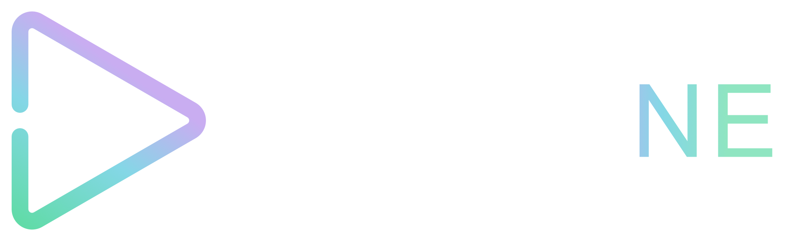

# mpv-ne

A clean, minimal video player built on **libmpv** + **iced** (Rust),
with a northern lights colour theme. Deep darks and aurora accents,
inspired by [PotPlayer](https://potplayer.tv/).



---

## Features

- Hardware-accelerated video via libmpv (H.264, H.265/HEVC, AV1, VP9, …)
- Custom dark UI - no OS chrome required
- **Focus mode** - hide all chrome with `H`, leaving only the video. Controls and top bar fade in on hover
- Seekbar thumbnail preview (generated in background, no ffmpeg required)
- **Live/growing MKV support** - designed for active recordings still being written to disk; `End` key jumps to the live edge with automatic catch-up, and playback resumes automatically as new content is buffered
- Playlist with sort, shuffle, save/load (.m3u)
- File browser & recent files panels
- Video equaliser (brightness, contrast, saturation, hue, gamma)
- Subtitle search via OpenSubtitles.com
- A-B loop, chapter navigation
- Snap-to-screen-edge window behaviour
- Resume playback from last position
- And more - see the Settings panel

---

## Platform support

| Platform | Status |
|----------|--------|
| Windows 10/11 | ✅ Tested |
| Linux | 🔧 Untested - code is structured for it, needs testing |
| macOS | 🔧 Untested - code is structured for it, needs testing |

Windows-specific features (snap-to-edge, window subclassing) are `#[cfg(target_os = "windows")]` guarded and degrade gracefully on other platforms.

## Building from source

### Prerequisites

| Tool | Where to get |
|------|-------------|
| Rust (stable) | https://rustup.rs |
| mpv import library (`mpv.lib`) | See below |
| libmpv DLL (`libmpv-2.dll`) | See below |

### libmpv

`mpv-lib/` contains the Windows import library stub (`mpv.lib`, 14 KB) - no mpv
source code, just symbol names. This is the same file mpv distributes in their
own dev packages for linking purposes.

You only need the **runtime DLL** (`libmpv-2.dll`). The build script copies it
automatically if found at one of the common locations, or set `MPV_DLL_DIR`:

```powershell
$env:MPV_DLL_DIR = "C:\path\to\folder\containing\libmpv-2.dll"
cargo build --release
```

**Windows** - get `libmpv-2.dll` from:
- **mpv.net** - https://github.com/mpvnet-player/mpv.net/releases
- **shinchiro's builds** - https://github.com/shinchiro/mpv-winbuild-cmake/releases  
  (`mpv-dev-x86_64-*.7z` → extract `libmpv-2.dll`)

**Linux** - install via package manager:
```sh
sudo apt install libmpv-dev   # Debian/Ubuntu
sudo pacman -S mpv            # Arch
```

**macOS** - install via Homebrew:
```sh
brew install mpv
```

### Build & run

```powershell
cargo run --release
```

---

## Project structure

```
src/
  app.rs          - application state & message handling
  player.rs       - libmpv wrapper
  ui/             - iced UI modules (controls, panels, …)
  thumbnail.rs    - seekbar thumbnail generation via libmpv
  opensubs.rs     - OpenSubtitles.com API client
  resume.rs       - resume position & metadata cache
  settings.rs     - persistent settings (TOML)
assets/           - icons, logo
mpv-lib/          - mpv.lib import library (not included, see above)
```

---

## Roadmap

- Rebuilt settings panel with full customisability (choose what appears, reorder sections)
- Right-click context menu on video
- Colour themes based on Nordic seasons
- Visual effects and animations
- Customisable button layout
- Mini player mode
- Picture-in-picture mode
- Audio spectrum visualizer
- Bookmark system (named timestamps)
- Stats overlay (bitrate, fps, dropped frames, buffer)
- Audio normalizer
- Audio pitch correction with speed change
- Pan and scan with mouse drag
- Zoom to fit / fill toggle
- Scrub preview (drag seekbar before releasing)
- Jump to next / previous subtitle
- Secondary subtitle track
- Remember per-file settings (volume, subtitle, audio track)
- Speed step customisation
- Network streams (RTSP, HLS, yt-dlp)
- Richer playlist formats
- File associations (register as default player)
- Remember window position per monitor
- Linux and macOS support

## Version

0.1.0 - initial public release

## Licence

MIT
